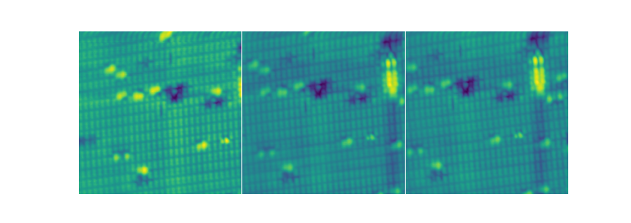
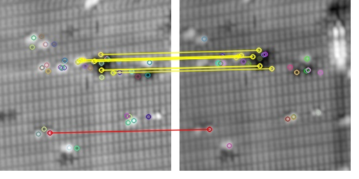
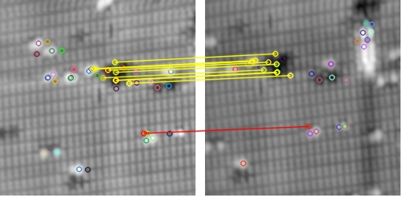
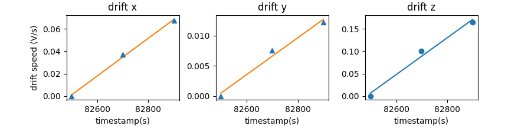

Drift Compensation By Feature Point Matching
===================================
An algorithm to automatically compensate drfit (thermal drift/piezo creep or so on) from sequence images.
 
It can be implemented in transmission electron microscopy, scanning electron microscopy, scanning probe microscopy, and etc...

Example (text.py)
-------
These 3 images (A,B,C) is acquired continuously by scanning tunneling microscopy.
Pixels in image shifts to right due to drift.

In the text.py script, the shift in A $\rightarrow$ B and A $\rightarrow$ C are calculted by feature point matching.
Also, this algorithm contains a selection algorithm to get rid of bad result (red line).

Finally, the drift speed can be calculated (Voltage/s).
These values can be fed to a scan instrument as FeedForward signals to cancel drift.

Installation
-------

Python version 3.* required.
 
Please install by the following command via pip:

(our scan data IO and data processing package)
* `pip install SPMUtil`

(some common packages)
* `pip install matplotlib, opencv-python, opencv-contrib-python`
